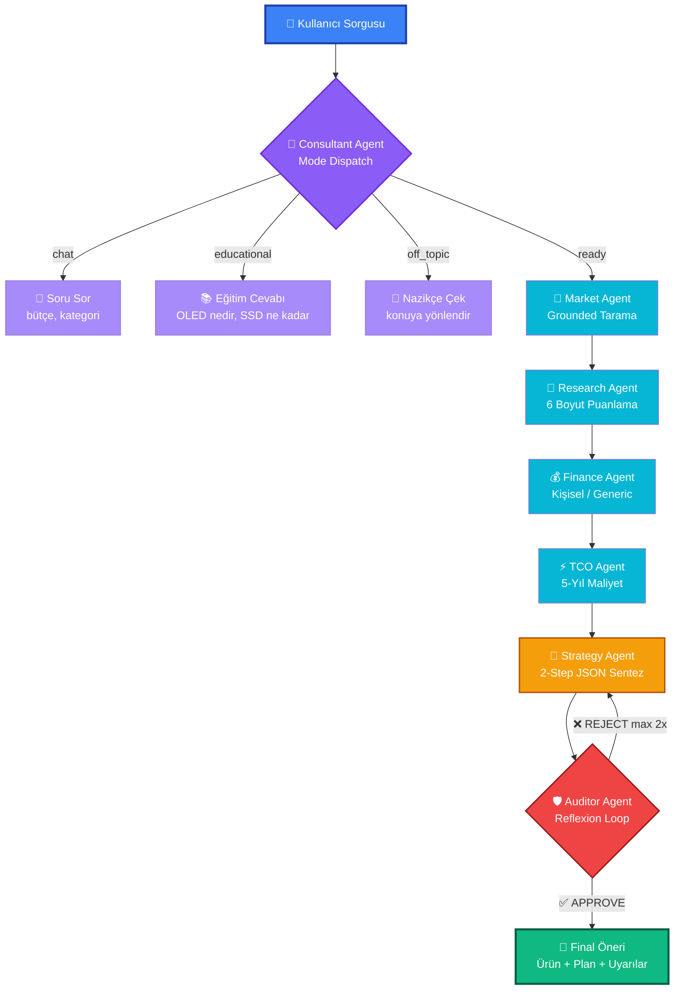

<div align="center">

# 🛒 OptiWallet

### **Türkiye'nin İlk Kanıt-Bazlı, Manifesto-Korumalı AI Alışveriş Danışmanı**

*"Sayıların ardındaki insanı gören, ucuz değil **doğru** olanı öneren bir dijital koç."*

[](https://github.com/Yunusygn/BTK-Hackathon2026-Optiwallet)
[](https://www.btkakademi.gov.tr)
[](LICENSE)

[](https://www.python.org)
[](https://fastapi.tiangolo.com)
[](https://nextjs.org)
[](https://www.typescriptlang.org)
[](https://www.postgresql.org)
[](https://ai.google.dev)
[](https://langchain-ai.github.io/langgraph/)
[](https://www.docker.com)

---

🇹🇷 **Türkiye Perspektifi** • 🤖 **7 Uzman AI Agent** • 🛡️ **Reflexion Auditor** • 💰 **5-Yıl TCO** • 🧠 **Akıllı Hafıza**

[**🎬 Demo Video**](#-demo) • [**🏗️ Mimari**](#%EF%B8%8F-mimari) • [**🚀 Kurulum**](#-hızlı-kurulum) • [**📖 Belgeler**](#-belgeler)

</div>

---

## 💔 Türkiye'de Online Alışverişin Gerçeği

> Trendyol, Hepsiburada, Amazon... Binlerce ürün, yüzlerce yorum, onlarca marka.  
> **Ama sorular hâlâ aynı:**

<table>
<tr>
<td width="50%" valign="top">

### 🚨 4 Büyük Sorun

| Sorun | Etkisi |
|-------|--------|
| 📚 **Bilgi Kirliliği** | Doğru ürünü bulmak saatler sürüyor |
| 💸 **Gizli Maliyetler** | 5 yıllık elektrik+aksesuar göz ardı ediliyor |
| 🔧 **Servis Riski** | "Ucuz aldım, servis bulamıyorum" |
| 🎭 **Manipülatif AI** | "Her şeye her şeyi öner" satış botları |

</td>
<td width="50%" valign="top">

### 💚 OptiWallet'ın Cevabı

| Yaklaşım | Çözüm |
|----------|-------|
| 🤖 **7 Uzman Agent** | Her biri TEK konuda uzman |
| 🛡️ **Manifesto Koruması** | Bütçeyi ASLA aşmaz, kötüyse "bekle" der |
| 🇹🇷 **Türkiye Bilinci** | Servis ağı, şikayet siteleri, gerçek veri |
| ⚖️ **Reflexion Auditor** | Kötü öneriyi REDDEDIP düzelttirir |

</td>
</tr>
</table>

---

## ✨ OptiWallet Neden Farklı?

<table>
<tr>
<th>Özellik</th>
<th align="center">Geleneksel AI Asistanları</th>
<th align="center">🏆 OptiWallet</th>
</tr>
<tr>
<td>Veri Kaynağı</td>
<td align="center">❌ Sadece eğitim verisi</td>
<td align="center">✅ Google Grounding (gerçek zamanlı)</td>
</tr>
<tr>
<td>Türkiye Servis Bilinci</td>
<td align="center">❌ Global perspektif</td>
<td align="center">✅ şikayetvar.com + Trendyol yorumları</td>
</tr>
<tr>
<td>Bütçe Güvenliği</td>
<td align="center">⚠️ Bütçe aşımı yapabilir</td>
<td align="center">✅ Manifesto-korumalı, asla aşmaz</td>
</tr>
<tr>
<td>5-Yıl Toplam Maliyet</td>
<td align="center">❌ Sadece etiket fiyatı</td>
<td align="center">✅ Elektrik + aksesuar + servis</td>
</tr>
<tr>
<td>Kalite Denetimi</td>
<td align="center">❌ Tek geçiş, "ne çıkarsa"</td>
<td align="center">✅ Reflexion auditor (otomatik düzeltme)</td>
</tr>
<tr>
<td>Halüsinasyon Koruması</td>
<td align="center">⚠️ Yok denecek kadar az</td>
<td align="center">✅ 3 katmanlı (Market+Strategy+Auditor)</td>
</tr>
<tr>
<td>Kişiselleştirme</td>
<td align="center">❌ Anonim</td>
<td align="center">✅ Gelir, kart, hedef bazlı kişisel finans</td>
</tr>
</table>

---

## 🎬 Demo

<div align="center">

### 💬 Sohbet Akışı

> *Kullanıcı:* `40K bütçeyle 55 inç TV, ailecek film izleyeceğiz`

<details>
<summary><b>📺 AI'ın Yaptıkları (3-5 dakika)</b></summary>

```
🎯 Consultant       → "Tam bilgi, ready mode!"
🛒 Market           → 18 ürün taradı, 8 kaliteli seçti
🔬 Research         → şikayetvar.com + forum + review (42 kaynak)
                     → 6 boyutta puanladı (servis, güvenilirlik...)
💰 Finance          → "Demo User, Akbank Axess'te 12 ay vade farksız"
⚡ TCO              → "5-yıl toplam: 47.969 TL (elektrik+aksesuar dahil)"
🧠 Strategy         → "LG QNED816 önerim, family_user için ideal"
🛡️ Auditor          → "Kalite %85, ONAYLANDI ✓"
```

</details>

</div>

> **Sonuç:** Detaylı ürün önerisi + 2 alternatif + 4 adımlı eylem planı + uyarılar + **TAM ürün linkleri (Trendyol/Hepsiburada arama)**.

---

## 🏗️ Mimari

### 📊 Sistem Akışı



### 🤖 7 Uzman Agent

| # | Agent | Rol | Teknoloji | ⏱️ |
|---|-------|-----|-----------|:-:|
| 1 | 🎯 **Consultant** | Niyet anlama, mod dispatcher | Gemini 2.5 Pro | ~8s |
| 2 | 🛒 **Market** | E-ticaret tarama, akıllı segmentasyon | Pro + Google Grounding | ~80s |
| 3 | 🔬 **Research** | Forum/şikayet/review (6 boyut) | 2-step + Grounding | ~55s |
| 4 | 💰 **Finance** | Türkiye finans değerlendirmesi | Pro + DB profili | ~15s |
| 5 | ⚡ **TCO** | 5-yıl toplam maliyet | Pro + EPDK Cache | ~50s |
| 6 | 🧠 **Strategy** | Sentez + persona-bazlı öneri | 2-step JSON | ~55s |
| 7 | 🛡️ **Auditor** | Reflexion kalite denetimi | Python + Pro | ~20s |

> **Toplam:** ~5 dakika, **42+ kaynaktan gerçek veri**, **%85+ kalite**

---

## 🚦 4 Akıllı Mod

Sistem **kullanıcının ne istediğini ANLAR** ve doğru pipeline'a yönlendirir:

<table>
<tr>
<th>Mod</th>
<th>Örnek</th>
<th>AI Davranışı</th>
</tr>
<tr>
<td>💬 <b>Chat</b></td>
<td><i>"TV almak istiyorum"</i></td>
<td>"Bütçeniz ne kadar?" sorar (eksik bilgi)</td>
</tr>
<tr>
<td>📚 <b>Educational</b></td>
<td><i>"OLED ve QLED farkı nedir?"</i></td>
<td>Detaylı eğitim cevabı verir</td>
</tr>
<tr>
<td>🚫 <b>Off-topic</b></td>
<td><i>"Bana şiir yaz"</i></td>
<td>"Ben alışveriş asistanıyım..." nazikçe çevirir</td>
</tr>
<tr>
<td>✅ <b>Ready</b></td>
<td><i>"40K bütçe 55 inç TV ailecek"</i></td>
<td>🚀 Full 7-agent pipeline çalışır</td>
</tr>
</table>

---

## 🔬 Research Agent — 6 Boyutlu Puanlama

Her ürün, **gerçek Türkiye verisi** ile değerlendirilir:

| Boyut | Veri Kaynağı | 🇹🇷 |
|-------|--------------|:-:|
| 🎯 **Performans** | Teknik testler, benchmark karşılaştırma | ✅ |
| 🔧 **Güvenilirlik** | şikayetvar.com (son 12 ay) | ✅ |
| 🛠️ **Servis & Destek** | Marka servis ağı, yedek parça erişimi | ✅ |
| 💎 **Fiyat/Performans** | Pazar karşılaştırma, alternatifler | ✅ |
| 😊 **Kullanıcı Memnuniyeti** | Trendyol/Hepsiburada/Forum yorumları | ✅ |
| ⏳ **Uzun Vadeli Kalite** | Yazılım desteği, 3-5 yıl tahmini | ✅ |

> 💡 **Türkiye Perspektifi Örneği:**  
> *"TCL global'de premium budget olarak parlıyor (8/10), ancak Türkiye'de servis ağı görece zayıf (5-6/10). LG ve Samsung Türkiye servis ağıyla 9/10 puan alıyor."*

---

## 🛡️ Reflexion Loop — Kalite Garantisi

Çoğu AI tek cevap verir ve gönderir. **OptiWallet farklı:**

```
1️⃣  Strategy üretir → Auditor denetler
2️⃣  Auditor 4 kritere bakar:
    ├─ Manifesto uyumlu mu? (bütçe, dürüstlük)
    ├─ Halüsinasyon var mı? (Market'te olmayan ürün)
    ├─ Persona uyumlu mu? (family_user için ucuz tahta TV önerme!)
    └─ Tutarlı mı? (Finance "bekle" derken Strategy "al" derse REJECT)

❌ REJECT → Audit feedback → Strategy YENİDEN üretir (max 2 deneme)
✅ APPROVE → Kullanıcıya teslim + "AI Denetim: %85 kalite" rozeti
```

**Sonuç:** Manipülatif satış YOK, halüsinasyon YOK, kalite garanti.

---

## 💎 Yenilikçi Tasarım Detayları

<details>
<summary><b>🎨 2-Step JSON Pipeline (Strateji & Research)</b></summary>

```
Step 1: AI yaratıcı DOĞAL DİL üretir (temperature=0.5)
       → Markdown başlıklı, esnek format
       
Step 2: Deterministik formatter JSON'a çevirir (temperature=0.0)
       → JSON mode garantili çıktı

Sonuç: Validation fail %0, kalite max
```
</details>

<details>
<summary><b>🛡️ 3 Katmanlı Halüsinasyon Koruması</b></summary>

```
Katman 1: Market sadece GERÇEK ürünler döndürür
Katman 2: Strategy "Market'te olmayan ürün?" → Market 1. ürünü fallback
Katman 3: Auditor Python pre-check (substring match)

Sonuç: AI uydurma ürün ÖNEREMEZ
```
</details>

<details>
<summary><b>🇹🇷 Persona-Bazlı Bütçe Kullanımı</b></summary>

| Persona | Bütçe Kullanımı | Mantık |
|---------|----------------|--------|
| `budget_user` | %40-70 | Tasarruflu, güvenli |
| `family_user` | %60-90 | Kaliteli, dayanıklı |
| `premium_user` | %80-100 | Max kalite |
| `tech_enthusiast` | Skor TOP 1 | Özellik bazlı |
| `general` | %60-85 | Denge |

</details>

<details>
<summary><b>⚡ EPDK Cache & Energy Label</b></summary>

```
Cache:
  - Türkiye kWh fiyatı: 2.80-3.50 TL (avg 3.23)
  - Kategori bazlı aksesuar fiyatları (TV, laptop, buzdolabı...)
  - Redis-ready (yoksa default değerler)

Energy Label Database:
  - EU A-G etiket → yıllık kWh
  - Kategori bazlı (TV, buzdolabı, çamaşır makinesi)
  - Gemini grounding ile gerçek veri
```
</details>

<details>
<summary><b>🔗 URL Garantisi (3 Üründe de Çalışan Link)</b></summary>

AI URL üretemese bile, her ürün için satıcıya özel arama URL'i oluşturulur:

- **Trendyol** → `trendyol.com/sr?q=...`
- **Hepsiburada** → `hepsiburada.com/ara?q=...`
- **Amazon** → `amazon.com.tr/s?k=...`
- **N11, MediaMarkt, Teknosa, Vatan** → Hepsi destekli

Demo'da hata YOK, kullanıcı her zaman ürüne ulaşır.

</details>

<details>
<summary><b>🧠 Akıllı Hafıza Mimarisi</b></summary>

```
Anonim Mod:
  ├─ Frontend state'te tutuluyor
  ├─ Request-based (her mesajda history gönderilir)
  └─ DB temiz (privacy)

Login Mod:
  ├─ DB'de tutuluyor (PostgreSQL)
  ├─ Conversation_id ile devam edilir
  ├─ Sidebar'da geçmiş sohbetler
  ├─ Tıklayınca tüm mesajlar + ürün kartları yüklenir
  └─ Sil/yeni sohbet/devam et — Claude/ChatGPT seviyesi UX
```
</details>

---

## 🛠️ Teknoloji Stack

<table>
<tr>
<th>Layer</th>
<th>Teknoloji</th>
<th>Neden Bu?</th>
</tr>
<tr>
<td><b>🧠 AI</b></td>
<td>Gemini 2.5 Pro + Google Grounding</td>
<td>En güçlü context window + gerçek zamanlı arama</td>
</tr>
<tr>
<td><b>🔗 Orchestration</b></td>
<td>LangGraph</td>
<td>Multi-agent workflow + state management</td>
</tr>
<tr>
<td><b>⚙️ Backend</b></td>
<td>FastAPI + Python 3.12</td>
<td>Async/await, ORJSONResponse, SSE streaming</td>
</tr>
<tr>
<td><b>💾 Database</b></td>
<td>PostgreSQL 16 + SQLAlchemy 2.0</td>
<td>JSONB desteği, async ORM</td>
</tr>
<tr>
<td><b>⚡ Cache</b></td>
<td>Redis</td>
<td>kWh fiyatı, aksesuar verisi (opsiyonel)</td>
</tr>
<tr>
<td><b>🎨 Frontend</b></td>
<td>Next.js 15 + TypeScript</td>
<td>App Router, SSR, type safety</td>
</tr>
<tr>
<td><b>🎭 UI</b></td>
<td>Tailwind CSS + Lucide React</td>
<td>Dark mode, mobile-first, icon set</td>
</tr>
<tr>
<td><b>📡 Streaming</b></td>
<td>Server-Sent Events (SSE)</td>
<td>Real-time agent progress</td>
</tr>
<tr>
<td><b>🐳 DevOps</b></td>
<td>Docker Compose</td>
<td>4 servis tek komutla (backend, frontend, DB, Redis)</td>
</tr>
</table>

---

## 🚀 Hızlı Kurulum

### 📋 Gereksinimler

- ✅ **Docker Desktop** (20.10+)
- ✅ **Gemini API Key** ([buradan al](https://aistudio.google.com/apikey) — free tier yeterli)
- ✅ ~2GB disk alanı, 4GB RAM

### ⚡ 3 Adımda Çalıştır

```bash
# 1️⃣ Repo'yu klonla
git clone https://github.com/Yunusygn/BTK-Hackathon2026-Optiwallet.git
cd BTK-Hackathon2026-Optiwallet

# 2️⃣ Environment ayarla
cp .env.example .env
# .env'i aç, GEMINI_API_KEY'i ekle

# 3️⃣ Başlat
docker-compose up -d
```

### 🌐 Erişim

| Servis | URL | Açıklama |
|--------|-----|----------|
| **Frontend** | http://localhost:3000 | Ana arayüz |
| **Backend API** | http://localhost:8000/docs | Swagger UI (auto-docs) |
| **Health Check** | http://localhost:8000/health | Servis durumu |


```

> 💡 Login olmadan da kullanabilirsin — anonim mod tam pipeline destekli, sadece kişisel finance yok.

---

## 🎯 Demo Senaryoları

### 🥇 Senaryo 1: TV Önerisi (Login)

```text
1. Login → demo@optiwallet.com / Demo1234!
2. "55 inç TV almak istiyorum"
   → AI: "Bütçeniz ne kadar?"
3. "40 bin lira"
   → AI: "Ne için kullanacaksınız?"
4. "Ailecek film izleyeceğiz"
   → AI: 🚀 Full pipeline başlar (~5 dk)
5. ✅ Ürün önerisi + 2 alternatif + 4 adımlı plan + uyarılar
6. Sidebar'da AYNI sohbette görünür
```

### 🥈 Senaryo 2: Eğitim Modu (Anonim)

```text
1. /chat (login yok)
2. "OLED ve QLED arasındaki fark nedir?"
   → AI: Detaylı teknik karşılaştırma
3. "Hangisi daha dayanıklı?"
   → AI: Uzun vadeli kullanım analizi
4. "Tamam, 40K bütçeyle bir tane öner"
   → AI: 🚀 Ready mode → ürün önerisi
```

### 🥉 Senaryo 3: Konu Dışı Test

```text
"Bana şiir yaz"
→ AI: "Ben OptiWallet alışveriş asistanıyım..."
```

---

## 🎯 Manifesto

> OptiWallet'ın değişmez 5 ilkesi:

```
1. 🛡️  Strict Budget Respect — Bütçeyi ASLA aşma
2. 💯  Strict Honesty — Alım kötüyse "bekle" de
3. 🇹🇷  Türkiye Bilinci — Servis ağı, şikayet sitelerini dikkate al
4. ❤️  Empati — Sayıların ardındaki insanı gör
5. 💎  Kalite > Ucuzluk — En uygunu öner, en ucuzu değil
```

---

## 📊 Sayılarla OptiWallet

<div align="center">

| 📈 Metrik | 🎯 Değer |
|-----------|---------:|
| 🤖 Uzman Agent | **7** |
| 🚦 Akıllı Mod | **4** |
| 🔍 Boyutlu Puanlama | **6** |
| 🎭 Persona Tipi | **5** |
| 🛒 Desteklenen E-Ticaret | **7** |
| 📚 Veri Kaynağı (avg) | **42+** |
| ⏱️ Pipeline Süresi | **~5 dk** |
| ✅ Auditor Kalite Skoru | **%85+** |
| 🔁 Reflexion Max Deneme | **2** |

</div>

---

## 🗺️ Roadmap

### ✅ v1.0 — Hackathon Release

- [x] 7 Agent Pipeline (LangGraph)
- [x] 4 Akıllı Mod (chat/educational/ready/off_topic)
- [x] Reflexion Auditor
- [x] Google Grounding (Market + Research)
- [x] TCO Cache + EPDK
- [x] Login + Anonim Mod
- [x] Sidebar Geçmiş Sohbetler (Claude/ChatGPT seviyesi)
- [x] Sohbet Silme + Devam Etme
- [x] Türkiye Perspektifi (şikayetvar, forum, review)
- [x] URL Garantisi (7 satıcı arama)
- [x] Dark Mode

### 🚧 v2.0 — Planlanan

- [ ] 📊 Favorileme + Fiyat Takibi
- [ ] 🔔 Fiyat Düşüş Alarmları (Celery)
- [ ] 🔐 Şifremi Unuttum (SendGrid/Mailgun)
- [ ] 📈 AI-Üretilen Ürün Karşılaştırma Tabloları
- [ ] 🌍 Çoklu Dil (EN, AR)
- [ ] 🤝 Bank API Integration (canlı limit/birikim)
- [ ] 📱 Mobil App (React Native)

---

## 📖 Belgeler

| Konu | Link |
|------|------|
| 🏗️ Mimari | [#mimari](#%EF%B8%8F-mimari) |
| 🚀 Kurulum | [#hızlı-kurulum](#-hızlı-kurulum) |
| 🎬 Demo | [#demo](#-demo) |
| 🛠️ API Docs | http://localhost:8000/docs |
| 💬 Issue Açmak İçin | [GitHub Issues](https://github.com/Yunusygn/BTK-Hackathon2026-Optiwallet/issues) |

---

## 👨‍💻 Geliştirici

<div align="center">

### **Yunus Emre Yeğin**

*Solo Developer — BTK Hackathon 2026*

[](https://github.com/Yunusygn)
[](https://github.com/Yunusygn/BTK-Hackathon2026-Optiwallet)

</div>

---

## 🙏 Teşekkürler

- 🎓 **BTK Akademi** — Bu inanılmaz hackathon imkanı için
- 🤖 **Google Gemini Team** — Güçlü AI API'si için
- 🌟 **Open Source Community** — FastAPI, Next.js, LangGraph, Tailwind ve daha onlarca araç için

---

## 📄 Lisans

```
MIT License — Detay için LICENSE dosyasına bakın.
Eğitim ve hackathon amaçlı geliştirilmiştir.
```

---

<div align="center">

### **🎯 OptiWallet — Dürüst Alışveriş, Akıllı Tasarruf** 🇹🇷

*"Bir alışveriş asistanı satış yapmaz, doğru kararı destekler."*

⭐ **Beğendiyseniz star vermeyi unutmayın!** ⭐

[](https://star-history.com/#Yunusygn/BTK-Hackathon2026-Optiwallet&Date)

</div>
